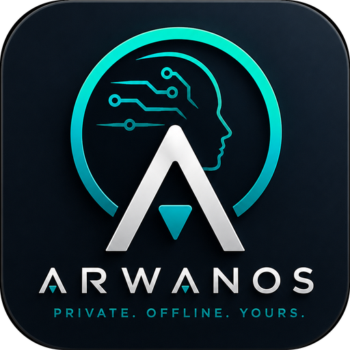
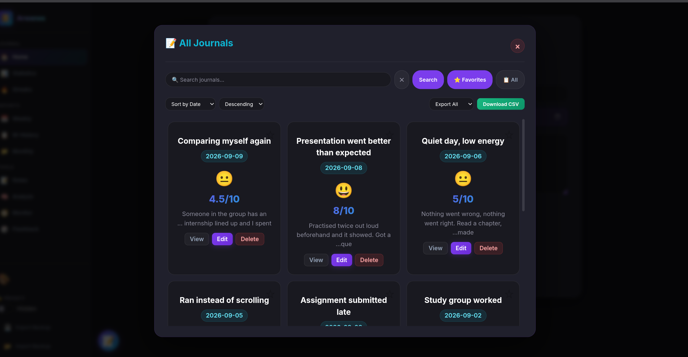
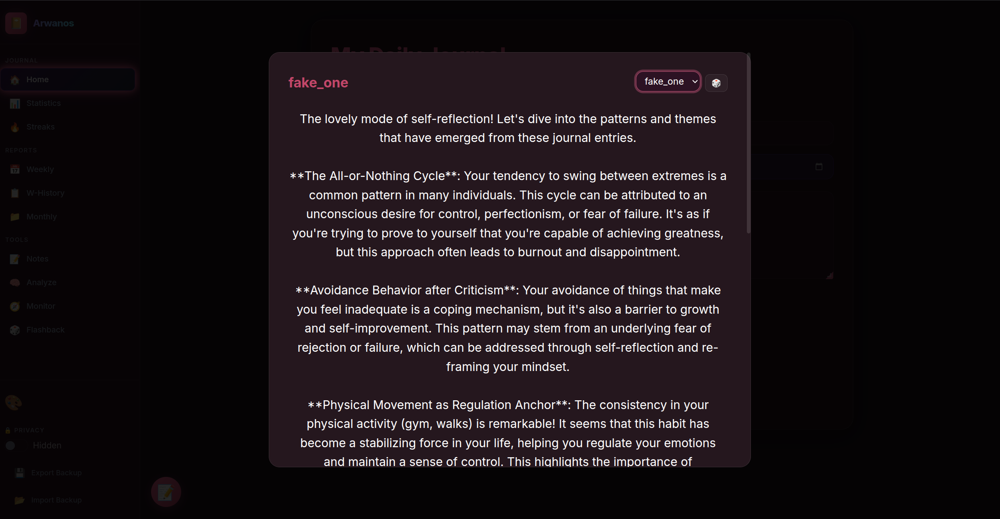
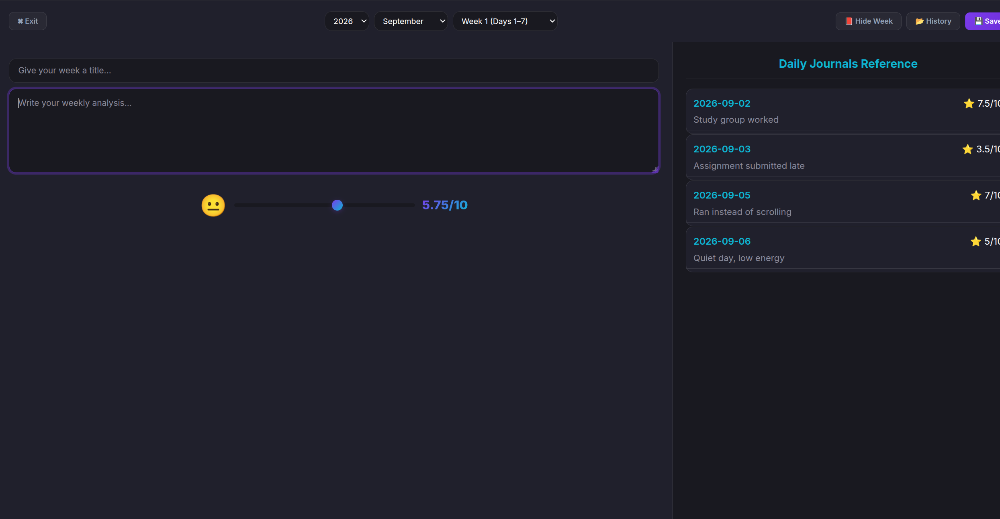
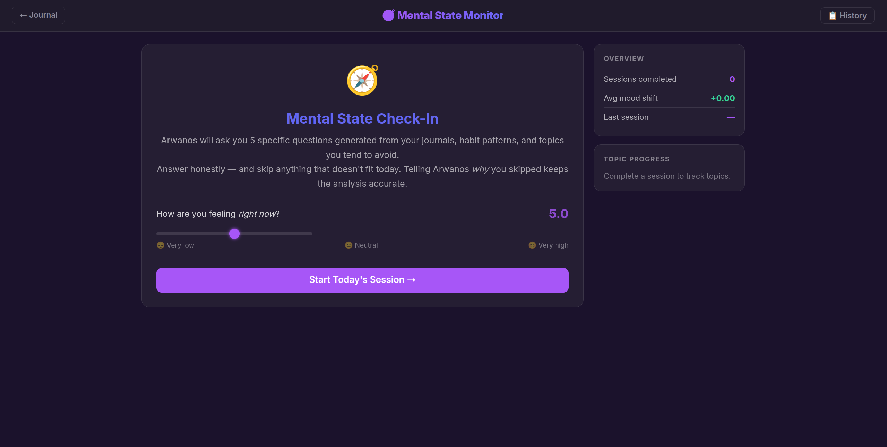

<div align="center">
  

  # Arwanos

  **A private AI companion that reads your journal, remembers you,<br/>and helps you see your own patterns — running entirely on your machine.**

  *Private. Offline. Yours.*

  [](LICENSE)

  [Quickstart](#quickstart) · [Features](#what-it-does) · [How it compares](#how-it-compares) · [Docs](#documentation) · [Roadmap](ROADMAP.md) · [Contributing](CONTRIBUTING.md)
</div>

---

## Why Arwanos

You journal to understand yourself. AI can genuinely help with that — spotting the loop you keep repeating, the trigger you don't notice, the progress you can't see from the inside.

But there's a gap:

- **AI journaling apps** do this well, and send your most private writing to a cloud model to do it.
- **Local LLM tools** keep your data at home, but they're general-purpose chat. They don't understand a journal, and they forget you between sessions.

Arwanos is built for that gap. It reads your journal, analyses it for behavioural and emotional patterns, and talks with you like a friend who remembers — **and nothing ever leaves your computer.**

Arwanos doesn't just chat. **It reads between the lines.**

### Who it's for

- **People who journal** and want real insight without handing their inner life to a cloud service
- **Local-LLM users** looking for a genuinely personal use case beyond a chat window
- **Developers and researchers** interested in long-term memory, retrieval, and psychology-aware prompting on small local models

---

## What it does

| | |
|---|---|
| 🧠 **Journal analysis** — `/analyze` | Reads your journal and reflects patterns back through six lenses: behavioural loops, emotional arc, avoidance, contradictions, growth, and relationships. |
| 💟 **Companion with memory** — `/lo` | A conversational companion that remembers you. Extracts facts from what you tell it, recalls past conversations by meaning, and knows how long it's been since you last talked. |
| 🧭 **Mental State Monitor** | Guided check-ins that adapt to your history and ask progressively deeper questions, backed by 7,557 locally indexed examples from professional psychology datasets. |
| 📓 **Journal, habits & reports** | A local web app for daily entries, habit tracking, and weekly and monthly reflections. |
| 🎤 **Voice** | Dictation and hands-free call mode, routed to the mode you choose, with noise-floor auto-calibration. *(Linux)* |
| 🔍 **Adaptive search** — `/deep` | Scores each question before answering, and only reaches for live web search when a question actually needs it. |

<p align="center">
  
  
  
  
</p>

<p align="center"><sub>Screenshots taken in Demo mode — the data shown is a fictional sample, not a real journal.</sub></p>

---

## Quickstart

**You need:** Python 3.10+, [Ollama](https://ollama.com), and about 5 GB of disk for the model. A GPU is strongly recommended — development and testing use an NVIDIA RTX 4060 (8 GB VRAM). Linux is the primary platform.

```bash
git clone https://github.com/GMMB1/Transmitted-Ai.git
cd Transmitted-Ai

ollama pull llama3:8b-instruct-q4_K_M

python -m venv .venv
source .venv/bin/activate          # Windows: .venv\Scripts\activate
pip install -r requirements.txt

python Arwanos_v10.py
```

The desktop app opens; click **Open Webui** for the journal at `http://127.0.0.1:5005/renderer`.

**Want to look around first?** Switch to **Demo mode** in Settings. It runs on a separate folder pre-filled with a fictional journal and habit history, so you can try the analysis and companion features before writing anything of your own.

Per-platform setup, GPU notes, voice requirements and troubleshooting: **[docs/INSTALL.md](docs/INSTALL.md)**

---

## How it compares

| | **Arwanos** | Cloud AI journaling apps | General local LLM front-ends |
|---|---|---|---|
| Where your writing goes | **Stays on your machine** | Sent to a cloud model | Stays on your machine |
| Built around a journal | **Yes** | Yes | Generic document upload |
| Behavioural pattern analysis | **Six analytical lenses** | Varies | No |
| Remembers you across sessions | **Facts + semantic recall + time awareness** | Varies | Usually not |
| Works offline | **Yes** | No | Yes |
| Cost | **Free and open source** | Usually a subscription | Free |

---

## Privacy and safety

**Your data never leaves your machine.** The model runs through Ollama on `127.0.0.1`. Your journal, memory, and conversations live in `data/`, which is gitignored and never uploaded. The only network access is optional live web search, and only for questions that need it.

**Arwanos is a self-reflection tool, not a therapist or a crisis service.** It can help you notice patterns; it can't diagnose, treat, or keep you safe in an emergency. If you're in crisis, contact your local emergency services, or find a free helpline in your country at [findahelpline.com](https://findahelpline.com).

Arwanos also declines requests in genuinely dangerous areas such as weapons capable of mass harm.

---

## Documentation

| Guide | What's in it |
|---|---|
| [Installation & troubleshooting](docs/INSTALL.md) | Per-platform setup, GPU configuration, configuration reference, desktop launcher, Windows `.exe` build |
| [Architecture](docs/ARCHITECTURE.md) | ARM adaptive resource management and the full command reference |
| [Mental State Monitor](docs/MENTAL_STATE_MONITOR.md) | The ML pipeline, question generation, anti-duplication, and dataset setup |

---

## Get involved

Arwanos began as a personal experiment and grew into a full application. It's at the stage where **feedback from real users shapes what comes next.**

- 💬 **Tried it?** [Share how it went](https://github.com/GMMB1/Transmitted-Ai/issues/new?template=feedback.yml) — even two sentences helps
- 🐛 **Found a bug?** [Report it](https://github.com/GMMB1/Transmitted-Ai/issues/new?template=bug_report.yml)
- 💡 **Have an idea?** [Suggest a feature](https://github.com/GMMB1/Transmitted-Ai/issues/new?template=feature_request.yml)
- 🛠️ **Want to contribute?** Start with the [contributing guide](CONTRIBUTING.md) and the [roadmap](ROADMAP.md)

---

## About

Arwanos is the reference implementation of **Transmitted AI** — an approach to local AI that combines psychological awareness, adaptive resource management, and behavioural analysis. Read the idea behind it: [Transmitted AI with Psychological Awareness](https://medium.com/python-in-plain-english/transmitted-ai-with-psychological-awareness-c6369cce8b8f).

Built by **GMM** · [GitHub](https://github.com/GMMB1) · [Support the project on Ko-fi](https://ko-fi.com/ghostman77506)

Released under the [MIT License](LICENSE).
